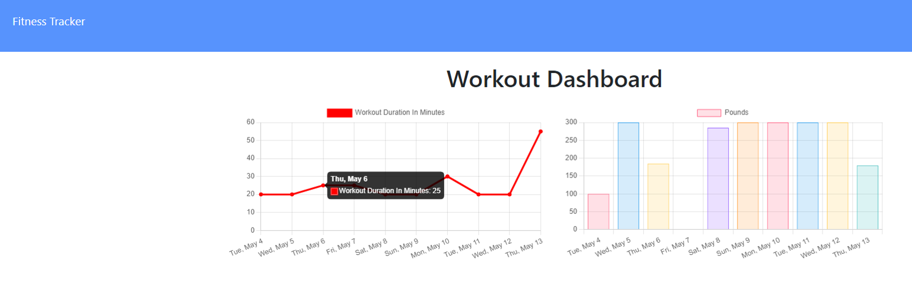

# WorkoutTracker 

[GitHub](https://github.com/alecfirstcode2021/yhlu_WorkoutTracker)

 Click <a href="https://keepinghealthy.herokuapp.com/">here</a> to view the live application!

 

<h1 align='center'>Description</h1>
 ### A workouttracker demo app that can help users tracking workouts and  make users' purpose-driven and more efficient.

 

## Table of Contents
- [Description](#description)
- [Installation](#installation)
- [Usage](#usage)
- [License](#license)
- [Contributing](#contributing)
- [Tests](#tests)
- [Questions](#questions)

## Installation
 express mongoose morgan

## Usage
 Follow walkthrough video

## License

 
This application is covered by the MIT license. 

## Contributing
 

## Tests
✏ 

## Questions
 
 
If you have any question, please contact me on [GitHub]  
 
or you can Email me:   

